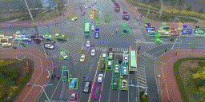
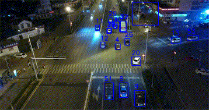
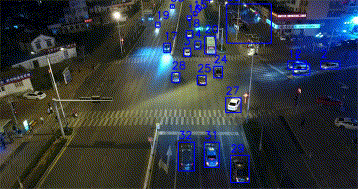

<div align="center">

[](https://songinpyo.github.io/SFTrack-Project/)
[](https://ieeexplore.ieee.org/abstract/document/10802537)
[](https://arxiv.org/abs/2410.20079)
[](https://i2slab.skku.edu/)

</div>


# 🚀 SFTrack

Official Repository of "**SFTrack: A Robust Scale and Motion Adaptive Algorithm for Tracking Small and Fast Moving Objects**" (IROS 2024)

## 📝 Abstract


This paper addresses the problem of multi-object tracking in Unmanned Aerial Vehicle (UAV) footage.
It plays a critical role in various UAV applications, including traffic monitoring systems and real-time suspect tracking by the police.
However, this task is highly challenging due to the fast motion of UAVs, as well as the small size of target objects in the videos caused by the high-altitude and wide angle views of drones.

In this study, we thus introduce a simple yet more effective method compared to previous work to overcome these challenges. Our approach involves a new tracking strategy, which initiates the tracking of target objects from low-confidence detections commonly encountered in UAV application scenarios. Additionally, we propose revisiting traditional appearance-based matching algorithms to improve the association of low-confidence detections.

To evaluate the effectiveness of our method, we conducted benchmark evaluations on two UAV-specific datasets (VisDrone2019, UAVDT) and one general object tracking dataset (MOT17). The results demonstrate that our approach surpasses current state-of-the-art methodologies, highlighting its robustness and adaptability in diverse tracking environments. Furthermore, we have improved the annotation of the UAVDT dataset by rectifying several errors and addressing omissions found in the original annotations. We will provide this refined version of the dataset to facilitate better benchmarking in the field.


## 🔑 Key Points

### ✅ Strength
- Excellent performance on videos with large numbers of tiny objects
- Robust tracking despite challenging camera motion
- Successfully handles low-confidence detections in UAV scenarios

### ⚠️ Weakness
- Higher computational requirements due to ReID features and traditional algorithms
- Processes many low-confidence detections, which impacts efficiency


## 🛠️ Installation

```bash
conda create -n sftrack python=3.8 -y
conda activate sftrack
pip install -r requirements.txt
pip3 install cython; pip3 install 'git+https://github.com/cocodataset/cocoapi.git#subdirectory=PythonAPI'
pip install cython_bbox
python setup.py develop
pip install "protobuf<3.21"
pip install "numpy<1.24"
```

### 📦 Pre-trained weights of YoloX
We borrowed weights file from [ByteTrack](https://github.com/ifzhang/ByteTrack).
For easier download we borrowed one link of theirs ([YoloX-MoT17](https://drive.google.com/file/d/1P4mY0Yyd3PPTybgZkjMYhFri88nTmJX5/view?usp=sharing)).


### 📦 Pre-trained weights of ReID
We borrowed weights files from [FastReID](https://github.com/JDAI-CV/fast-reid)
For easier download we borrowed links of theirs:
1. For human: [MSMT17 BoT(R50-ibn)](https://github.com/JDAI-CV/fast-reid/releases/download/v0.1.1/msmt_bot_R50-ibn.pth)
2. For vehicles: [VERI-Wild BoT(R50-ibn)](https://github.com/JDAI-CV/fast-reid/releases/download/v0.1.1/veriwild_bot_R50-ibn.pth)

You can find more model variants and weights [here](https://github.com/JDAI-CV/fast-reid/blob/master/MODEL_ZOO.md)


## 🎬 Demo

Run the tracker on your own videos:

```bash
python3 tools/demo_track.py sftrack -f exps/example/mot/yolox_x_mix_det.py -c pretrained/bytetrack_x_mot17.pth.tar --path ./demo/video.mp4 --fp16 --fuse --save_result
```

### 📊 Qualitative Results


To see more detailed qualitative results, visit our [project website](https://songinpyo.github.io/SFTrack-Project/).


## 🔄 Refined UAVDT Dataset Annotation
We identified and corrected numerous errors and omissions in the UAVDT dataset annotations to improve benchmarking quality.

### Before and After Comparison:

| Original Annotation | Refined Annotation |
|:-------------------:|:------------------:|
|  |  |

The refined annotations show significant improvements in object tracking consistency and accuracy.

To download our refined annotation dataset, visit the [project page](https://songinpyo.github.io/SFTrack-Project/).


## 📢 News
- 🆕 (2025.03) Codes are available.
- 🆕 (2024.11) Refined UAVDT dataset annotations are available.
- 🎉 (2024.06) Our paper is accepted by **IROS 2024** selected as **Long Oral**!


## 📚 Citation
```bibtex
@inproceedings{song2024sftrack,
  title={SFTrack: A Robust Scale and Motion Adaptive Algorithm for Tracking Small and Fast Moving Objects},
  author={Song, Inpyo and Lee, Jangwon},
  booktitle={2024 IEEE/RSJ International Conference on Intelligent Robots and Systems (IROS)},
  pages={10870--10877},
  year={2024},
  organization={IEEE}
}
```

## 🙏 Acknowledgement
We would like to express our sincere gratitude to the following projects whose excellent work has contributed significantly to this repository:

- [YOLOX](https://github.com/Megvii-BaseDetection/YOLOX)
- [ByteTrack](https://github.com/ifzhang/ByteTrack)
- [BoT-Sort](https://github.com/NirAharon/BoT-SORT)
- [FastReID](https://github.com/JDAI-CV/fast-reid)

Large portions of code have been adapted from these projects, and we deeply appreciate the contributions of their respective authors and communities.